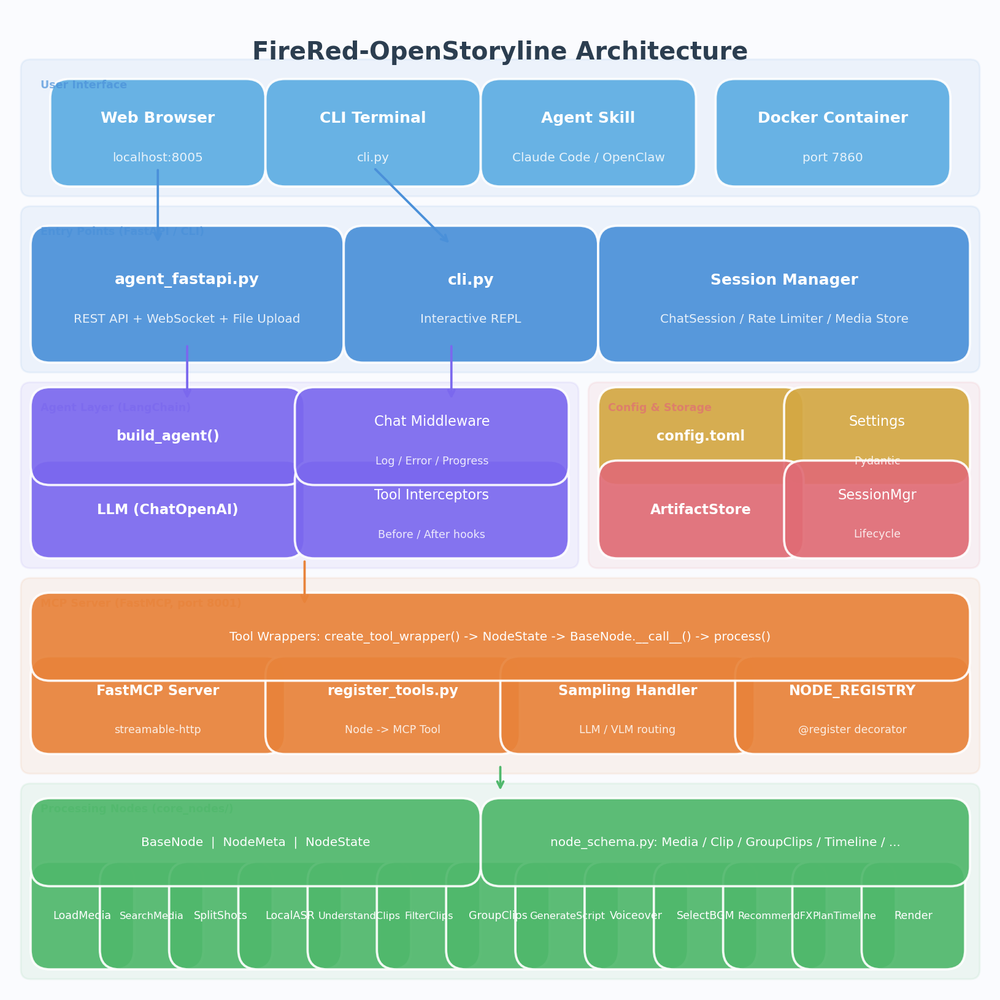
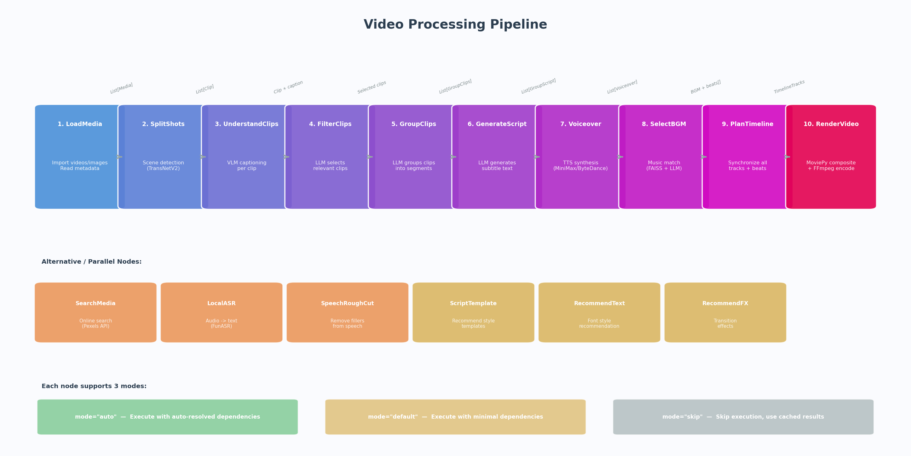
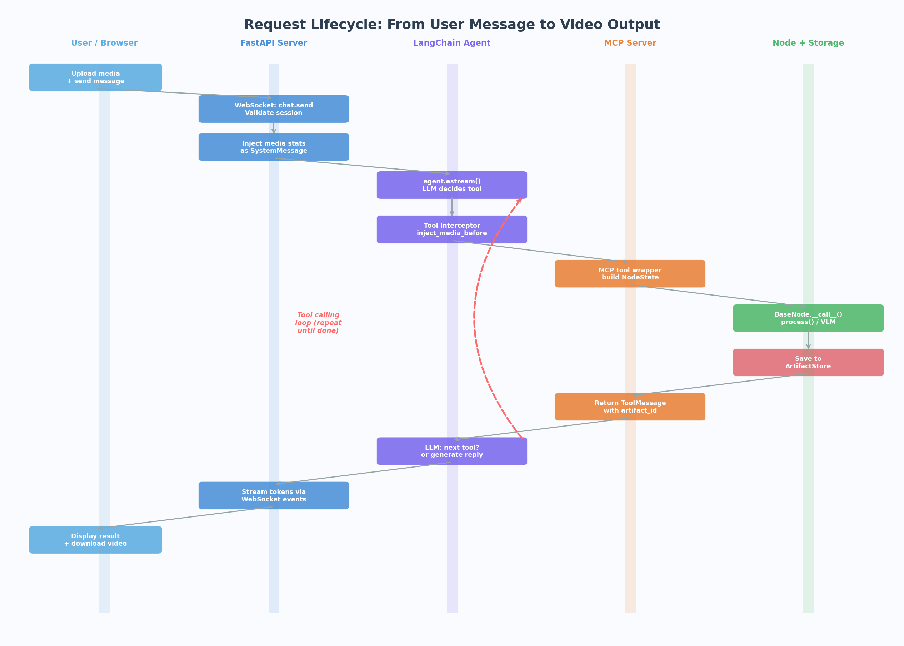
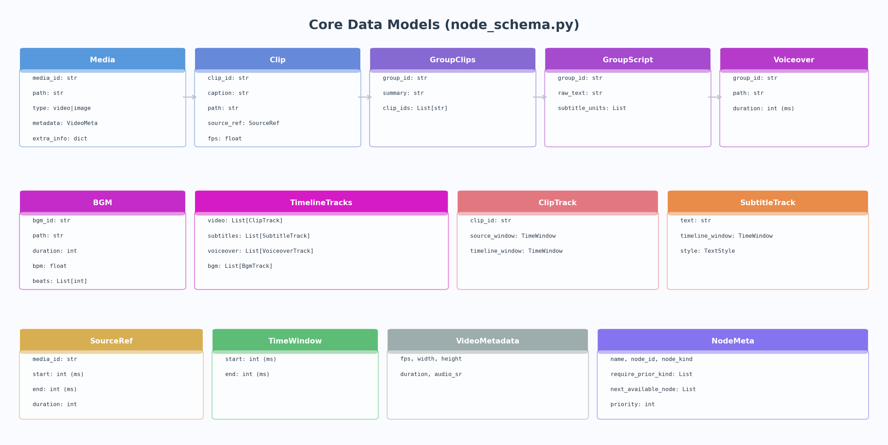

# FireRed-OpenStoryline 项目架构详解

> 本文档对 FireRed-OpenStoryline 的整体架构、核心模块、运行逻辑和数据流进行详细剖析。

---

## 一、项目定位

FireRed-OpenStoryline 是一个 **AI 驱动的智能视频创作平台**，用户只需用自然语言描述需求，系统即可自动完成从素材导入、镜头分割、文案生成、配音合成到最终渲染的完整视频制作流程。

核心技术栈：
- **Python 3.11+** — 主语言
- **FastAPI + Uvicorn** — Web 服务
- **LangChain** — Agent 框架（多轮工具调用）
- **MCP (Model Context Protocol)** — 工具注册与执行协议
- **MoviePy + FFmpeg** — 视频处理与渲染
- **TransNetV2** — 镜头分割模型
- **FAISS + SentenceTransformers** — 向量相似度搜索（BGM 匹配）
- **OpenAI 兼容 API** — LLM / VLM 调用

---

## 二、整体架构



> 可交互版本: [architecture_overview.drawio](diagrams/architecture_overview.drawio) (用 [draw.io](https://app.diagrams.net) 打开)

系统从上到下分为 **五层**：

### 2.1 用户接入层

| 入口 | 说明 |
|------|------|
| **Web Browser** | 访问 `localhost:8005`，通过 WebSocket 实时对话 |
| **CLI Terminal** | 运行 `python cli.py`，交互式命令行 |
| **Agent Skill** | 通过 Claude Code 或 OpenClaw 的 Skill 系统调用 |
| **Docker** | 容器化部署，端口 7860 |

### 2.2 入口服务层

**`agent_fastapi.py`** — 主服务入口（约 2700 行），核心功能包括：

- **Session 管理**：每个会话独立维护 `ChatSession`，包含媒体文件、对话历史、Agent 实例
- **WebSocket 聊天**：接收 `chat.send` 消息，流式返回 LLM tokens 和工具调用事件
- **文件上传**：支持直传和分片上传（断点续传），自动生成缩略图
- **速率限制**：基于 Token Bucket 的 IP 级和全局级限流
- **并发控制**：WebSocket 最大 500 连接，聊天最大 80 并发

**`cli.py`** — 轻量 CLI 入口（约 100 行）：
- 单用户交互循环
- 每轮扫描 `media_dir` 注入素材统计信息
- 调用 `agent.ainvoke()` 完成完整工具链

### 2.3 Agent 层（LangChain）

Agent 层是系统的「大脑」，负责理解用户意图并协调各节点完成任务。

**`agent.py` 中的 `build_agent()` 工厂函数：**

```
1. 验证 LLM / VLM 的 API Key（发送测试请求）
2. 创建 ChatOpenAI 实例（OpenAI 兼容接口）
3. 通过 MultiServerMCPClient 连接 MCP Server，获取所有工具
4. 加载用户自定义 Skills
5. 组装 LangChain Agent：模型 + 工具 + 中间件 + 存储
```

**核心组件：**

| 组件 | 文件 | 职责 |
|------|------|------|
| `ClientContext` | `agent.py` | 运行时上下文：session_id、配置、LLM 连接池 |
| `Tool Interceptors` | `hooks/node_interceptors.py` | 工具执行前注入素材、执行后保存结果 |
| `Chat Middleware` | `hooks/chat_middleware.py` | 日志记录、错误处理、进度推送 |
| `NodeManager` | `node_manager.py` | 管理节点依赖关系和执行顺序 |

### 2.4 MCP Server 层

MCP Server 运行在 **8001 端口**，负责将所有视频处理节点暴露为可调用的工具。

**`server.py`：**
- 基于 `FastMCP` 创建服务，使用 `streamable-http` 传输协议
- `SessionLifecycleManager` 管理会话生命周期（3 天过期，最多 256 个会话）

**`register_tools.py`：**
- 扫描 `NODE_REGISTRY` 中所有已注册的节点
- 为每个节点调用 `create_tool_wrapper()` 生成 MCP 工具
- 工具调用时：提取 `session_id` → 构建 `NodeState` → 调用 `BaseNode.__call__()`

**`sampling_handler.py`：**
- 处理节点内部的 LLM/VLM 调用请求
- 如果输入包含图片/视频，路由到 VLM；否则使用 LLM
- 视频采样：按 3fps 抽帧，每段 2-6 帧，转为多模态消息

### 2.5 节点处理层

这一层是系统的「双手」，执行实际的视频处理逻辑。

---

## 三、视频处理流水线



> 可交互版本: [processing_pipeline.drawio](diagrams/processing_pipeline.drawio) (用 [draw.io](https://app.diagrams.net) 打开)

### 3.1 主流水线（10 步）

整个视频创作流程由 10 个核心节点按序执行：

| 步骤 | 节点 | 输入 | 核心逻辑 | 输出 |
|------|------|------|----------|------|
| 1 | **LoadMedia** | 用户上传的文件 | 读取视频/图片元数据（分辨率、帧率、时长） | `List[Media]` |
| 2 | **SplitShots** | Media 列表 | TransNetV2 场景检测 → FFmpeg 无损切割 | `List[Clip]` |
| 3 | **UnderstandClips** | Clip 列表 | VLM 逐段抽帧理解，生成描述文字 | Clip + caption |
| 4 | **FilterClips** | 用户需求 + Clip 描述 | LLM 根据需求筛选相关片段 | 选中的 Clip ID |
| 5 | **GroupClips** | 选中的 Clips | LLM 按叙事逻辑分组，形成段落结构 | `List[GroupClips]` |
| 6 | **GenerateScript** | 分组 + 描述 + 用户需求 | LLM 为每个段落生成字幕文案 | `List[GroupScript]` |
| 7 | **GenerateVoiceover** | 文案 + TTS 配置 | 调用 TTS 服务合成语音（MiniMax/ByteDance） | `List[Voiceover]` |
| 8 | **SelectBGM** | 用户需求 | FAISS 语义搜索 + LLM 选择 → 节拍分析 | `BGM` + beats |
| 9 | **PlanTimeline** | 全部数据 | 对齐视频、字幕、配音、音乐到统一时间线 | `TimelineTracks` |
| 10 | **RenderVideo** | TimelineTracks | MoviePy 合成 + FFmpeg 编码（libx264） | 最终 MP4 |

### 3.2 辅助节点

| 节点 | 用途 |
|------|------|
| **SearchMedia** | 通过 Pexels API 在线搜索图片/视频素材 |
| **LocalASR** | 使用 FunASR 对视频音频进行语音识别转文字 |
| **SpeechRoughCut** | 自动去除口播中的语气词、重复句、停顿 |
| **ScriptTemplateRecommendation** | 推荐文案风格模板（种草、Vlog、测评等） |
| **RecommendText** | 推荐字体、字号、颜色、描边等文字样式 |
| **RecommendTransition** | 推荐转场效果 |

### 3.3 节点执行模式

每个节点支持三种执行模式：

- **`auto`**：自动解析并执行所有前置依赖节点（默认模式）
- **`default`**：使用最小依赖执行
- **`skip`**：跳过执行，使用缓存结果

---

## 四、请求生命周期



> 可交互版本: [request_lifecycle.drawio](diagrams/request_lifecycle.drawio) (用 [draw.io](https://app.diagrams.net) 打开)

一条用户消息从发送到生成视频的完整流程：

### Step 1: 用户发送消息

用户在 Web 界面上传素材并输入文字指令（例如「帮我把这些旅行视频剪成一个 Vlog」），通过 WebSocket 以 `chat.send` 事件发送到服务器。

### Step 2: FastAPI 接收并预处理

```python
# agent_fastapi.py 中的 WebSocket handler
1. 验证 session_id，获取 ChatSession
2. 从 pending_media_ids 取出待附加的媒体文件
3. 将媒体统计信息注入为 SystemMessage（告知 LLM 有哪些素材可用）
4. 将用户消息封装为 HumanMessage 追加到 lc_messages
```

### Step 3: Agent 决策循环

```python
# LangChain Agent 的多轮工具调用循环
agent.astream({"messages": lc_messages}, context=client_context)
```

LLM 分析用户意图后，决定调用哪个工具。例如：
- 用户说「剪个视频」→ LLM 决定先调用 `LoadMedia`
- 用户说「换个配乐」→ LLM 直接调用 `SelectBGM`

### Step 4: 工具拦截器（Before）

`inject_media_content_before()` 在节点执行前：
1. 检查前置依赖是否已完成（通过 `NodeManager.check_executable()`）
2. 如果有缺失的依赖，**递归执行**前置节点
3. 收集前置节点输出，注入到当前节点的输入参数中
4. 根据传输策略（`inline_media`）决定使用路径或 base64 传输媒体

### Step 5: MCP 工具执行

```python
# register_tools.py 中的 tool_wrapper
1. 从请求头提取 session_id
2. 构建 NodeState（session_id, artifact_id, llm_client, ...）
3. 调用 BaseNode.__call__()
   ├─ load_inputs_from_client()  # 解压 base64 / 解析路径
   ├─ process()                   # 执行核心逻辑
   └─ pack_outputs_to_client()    # 压缩输出供传输
4. 返回 {artifact_id, summary, result, isError}
```

### Step 6: 工具拦截器（After）

`save_media_content_after()` 在节点执行后：
- 将结果保存到 `ArtifactStore`（`outputs/{session_id}/{node_id}/{artifact_id}.json`）
- 解压 base64 媒体文件到服务端缓存
- 返回 `ToolMessage` 给 Agent

### Step 7: 循环或结束

Agent 收到工具返回后，LLM 决定：
- **继续**：调用下一个节点（回到 Step 3）
- **结束**：生成最终文本回复，通过 WebSocket 流式返回给用户

整个过程中，WebSocket 持续推送：
- `assistant.delta` — LLM 文本流
- `tool_start` / `tool_end` — 工具调用状态
- `progress` — 节点处理进度

---

## 五、核心数据模型



> 可交互版本: [data_model.drawio](diagrams/data_model.drawio) (用 [draw.io](https://app.diagrams.net) 打开)

数据在流水线中逐步变换，关键模型定义在 `src/open_storyline/nodes/node_schema.py`：

### 5.1 数据流转路径

```
Media                    原始素材（视频/图片 + 元数据）
  ↓ SplitShots
Clip                     分割后的片段（clip_id + source_ref + 路径）
  ↓ UnderstandClips
Clip + caption           带有 VLM 生成描述的片段
  ↓ FilterClips
selected clip_ids        筛选后的片段 ID 列表
  ↓ GroupClips
GroupClips               按叙事分组（group_id + summary + clip_ids[]）
  ↓ GenerateScript
GroupScript              每组的文案（raw_text + subtitle_units[]）
  ↓ GenerateVoiceover
Voiceover                每组的配音文件（path + duration_ms）
  ↓ SelectBGM
BGM                      背景音乐（path + bpm + beats[]毫秒时间戳）
  ↓ PlanTimeline
TimelineTracks           统一时间线（video[] + subtitles[] + voiceover[] + bgm[]）
  ↓ RenderVideo
MP4                      最终输出视频
```

### 5.2 关键模型说明

| 模型 | 说明 |
|------|------|
| `Media` | media_id, path, type(video/image), metadata(fps/分辨率/时长) |
| `Clip` | clip_id, caption, path, source_ref(来源 media_id + 起止时间) |
| `GroupClips` | group_id, summary(段落摘要), clip_ids[](有序片段列表) |
| `GroupScript` | group_id, raw_text(完整文案), subtitle_units[](分句字幕) |
| `Voiceover` | group_id, path(WAV 文件), duration(毫秒) |
| `BGM` | bgm_id, path, bpm, beats[](每个鼓点的毫秒时间戳) |
| `TimelineTracks` | 四轨合一：视频轨、字幕轨、配音轨、音乐轨 |
| `ClipTrack` | clip_id + source_window(素材时间窗) + timeline_window(时间线位置) |
| `TimeWindow` | start(ms), end(ms) — 时间线上的一个区间 |

---

## 六、存储与会话管理

### 6.1 ArtifactStore（制品存储）

每个节点的执行结果都会被持久化：

```
outputs/
└── {session_id}/
    ├── meta.json              # 所有制品的索引
    ├── load_media/
    │   └── {artifact_id}.json # LoadMedia 的输出
    ├── split_shots/
    │   └── {artifact_id}.json
    ├── generate_script/
    │   └── {artifact_id}.json
    └── render_video/
        └── {artifact_id}.json
```

- `save_result()` 保存节点输出，自动解压 base64 媒体
- `load_result()` 按 artifact_id 读取
- `get_latest_meta()` 获取某节点最新一次执行结果

### 6.2 SessionLifecycleManager（会话生命周期）

- 最多保留 **256 个会话**
- 超过 **3 天**未活跃的会话自动清理
- 清理操作为非阻塞，通过锁避免并发

---

## 七、配置系统

所有配置集中在 `config.toml`，由 Pydantic 模型解析（`src/open_storyline/config.py`）：

```
config.toml
├─ [developer]         开发者选项（debug 模式、打印完整上下文）
├─ [project]           项目路径（media_dir, bgm_dir, outputs_dir）
├─ [llm]               LLM 配置（model, base_url, api_key, temperature）
├─ [vlm]               VLM 配置（视觉模型，用于理解视频画面）
├─ [local_mcp_server]  MCP 服务配置（端口、传输方式、可用节点列表）
├─ [search_media]      Pexels API Key（在线搜索素材）
├─ [split_shots]       TransNetV2 模型路径和设备
├─ [understand_clips]  抽帧参数（fps, 最大帧数）
├─ [group_clips]       分组 Token 预算和重试策略
├─ [generate_voiceover] TTS 服务商配置（MiniMax / ByteDance / 302）
├─ [select_bgm]        音乐特征分析参数
├─ [plan_timeline]     时间线参数（节拍对齐、片段最小时长等）
└─ [plan_timeline_pro] 高级时间线参数
```

支持环境变量覆盖：`OPENSTORYLINE_LLM_*`、`OPENSTORYLINE_VLM_*`、`OPENSTORYLINE_CONFIG`。

---

## 八、Prompt 模板系统

所有 LLM 提示词存放在 `prompts/tasks/` 目录，支持中英文双语：

```
prompts/tasks/
├── instruction/          系统指令（主 System Prompt）
├── understand_clips/     VLM 画面理解提示词
├── filter_clips/         片段筛选提示词
├── group_clips/          片段分组提示词
├── generate_script/      文案生成提示词
├── generate_voiceover/   TTS 参数推断提示词
├── select_bgm/           BGM 选择提示词
└── ...
```

通过 `PromptBuilder` 加载并渲染模板：
```python
build_prompts("filter_clips", lang="zh", user_request="...", clip_captions="...")
# → {"system": "...", "user": "..."}
```

---

## 九、关键设计模式总结

| 模式 | 说明 |
|------|------|
| **节点依赖自动解析** | 每个节点声明 `require_prior_kind`，拦截器在执行前递归补齐缺失的前置节点 |
| **Before/After 拦截器** | 工具调用前注入素材和配置，调用后保存结果到制品库 |
| **透明媒体传输** | 根据 `inline_media` 配置自动选择路径传输或 base64（本地 vs 远程） |
| **会话隔离** | 每个会话独立的素材目录、制品存储、Agent 实例 |
| **多模态路由** | 输入含图片/视频时自动路由到 VLM，纯文本路由到 LLM |
| **流式推送** | WebSocket 实时推送 LLM tokens、工具状态、处理进度 |
| **三模式执行** | auto / default / skip 灵活控制节点是否自动执行依赖 |

---

## 十、一句话理解整个系统

> 用户发一句话 → FastAPI 接收 → LangChain Agent 决定调哪些工具 → MCP Server 依次执行节点（加载素材 → 分镜 → 理解 → 筛选 → 分组 → 写文案 → 配音 → 选曲 → 排时间线 → 渲染）→ 每步结果存入 ArtifactStore → 最终输出 MP4 视频。
